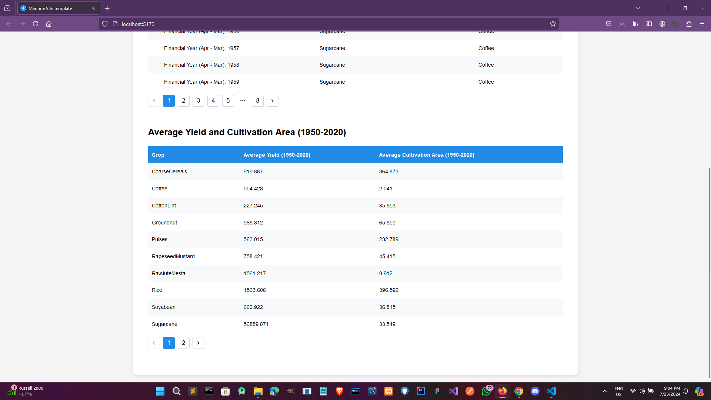
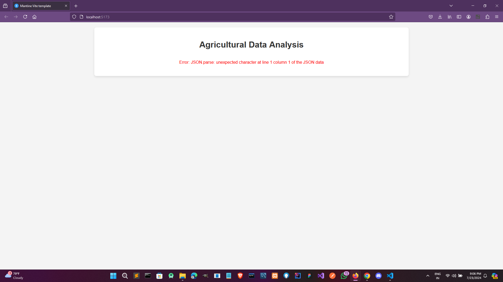
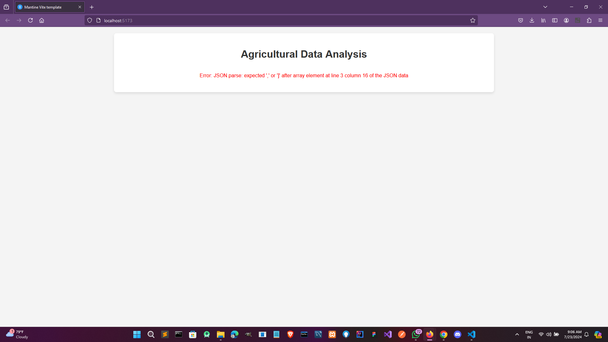

# Agricultural Data Analysis

This project is designed to analyze agricultural data from the National Data and Analytics Platform, NITI Aayog, and display it in a user-friendly way using tables. The application is built using React and styled with Mantine. The tables display the crop with the maximum and minimum production for each year, as well as the average yield and cultivation area for each crop between 1950-2020.

## Table of Contents

- [Features](#features)
- [Installation](#installation)
- [Running the Project](#running-the-project)
- [Project Structure](#project-structure)
- [Screenshots](#screenshots)
- [Technologies Used](#technologies-used)


## Features

- Display maximum and minimum crop production per year.
- Calculate and display average yield and cultivation area per crop (1950-2020).
- Styled using Mantine for a clean and modern look.

## Installation

1. Clone the repository:
   ```bash
   git clone <repository-url>
   cd agro-data-analysis
   ```

2. Install dependencies using Yarn:
   ```bash
   yarn install
   ```

## Running the Project

1. Ensure you are in the project directory.
2. Start the development server:
   ```bash
   yarn dev
   ```

The application will launch in your default web browser at `http://localhost:3000`.

## Project Structure

```
public/
├── agroDataset.json
src/
├── components/
│   ├── MaxMinTable.tsx
│   └── AverageTable.tsx
├── hooks/
│   └── useAgroData.tsx
│── App.css
├── App.tsx
├── main.tsx
```

- `components/`: Contains React components for displaying tables.
- `agroDataset.json`: Contains the agricultural dataset.
- `hooks/`: Contains custom hooks for loading and processing data.
- `App.css`: Contains global CSS styles.
- `App.tsx`: Main app component.
- `main.tsx`: Entry point for the React app.

## Screenshots

### Main Application View



### Error Handling




## Technologies Used

- **React**: A JavaScript library for building user interfaces.
- **Mantine**: An extensive library of React components and hooks for building modern web applications.
- **TypeScript**: A strongly typed programming language that builds on JavaScript.
- **Yarn**: A package manager for JavaScript.
- **Vite Min Template**: A minimal Vite template for rapid development with Vite.